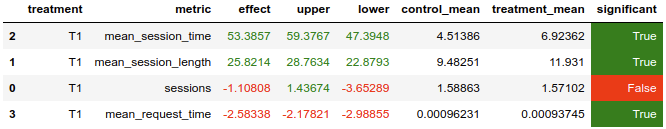

# Домашнее задание

## Данные

Использовал датасет на 1.3 млн. сессий, любезно предоставленный ребятами в чатике курса.

Исходник лежит тут: `/user/mob2021032/joined_dataset`

Моя копия (использую ее): `/user/mob2021045/joined_data_1m`

Для обучения модели из данных вытаскиваю пары `user-track`.
Чтобы сделать из _explicit_ датасета _implicit_ датасет, считаю, что если `time > 0.8`, то `1`, иначе - `0`.
В общем, как на одном из семинаров.

Сбор данных находится в файлике `collect_data.ipynb`.

## Модель рекоммендера

Мой рекоммендер основан на `Indexed` с семинаров.
- Используются предпосчитанные рекомендации из __50__ песен для каждого пользователя.
- Рекомендации из списка выдаются __не__ случайные, а в порядке убывания релевантности.
- Все предложенные пользователю песни в течение сессии сохраняются в редис (`REDIS_REC_HISTORY`),
и если трек уже предлагался пользователю в этой сессии, то повторно он рекомендоваться не будет.
- Если для данного пользователя не осталось треков, которые можно порекомендовать из сохраненного
списка, то выдается случайный трек из __топ 100__ популярных.

Сама модель - простой автоэнкодер (`MultiDAE`) с размерностями слоев `50000-300-50-300-50000`. Обучается на матрице interactions. Лосс - кросс энтропия. 10 эпох.

Номера треков для каждого пользователя - позиции наибольших 50 логитов на выходе автоэнкодера (отсортированные в порядке убывания значений логитов).

Обучение модели в ноутбуке `train_multidae.ipynb`.

## A/B эксперимент

В варианте __A__ используется модель `StickyArtist`, в __B__ - моя.
Сэмпл из 10000 сессий, разделение пополам.

Логи лежат в hdfs тут: `/user/mob2021045/ab_test_results/`.



Анализ эксперимента можно найти в файлике `analyze_results.ipynb`.

## Как запускать

1. Идем на кластер, захватив с собой `collect_data.ipynb`. 
В результате выполнения ноутбука получаем файлик `user-track.pkl`.
2. Топаем туда, где будем запускать обучение модели, захватив с собой ноутбук
`train_multidae.ipynb`, а также `user-track.pkl` и `requirements.txt` с ним в придачу.
Кладем файлики рядом с ноутбуком, запускаем ноутбук. На выходе получится `recommendations.json`,
забираем его с собой.
3. Помещаем наш `recommendations.json` по адресу `botify/data/recommendations.json`.
4. Поднимаем контейнер с botify.
```bash
docker-compose up -d --build
```
5. Теперь можно запускать симулятор (не забываем для него установить зависимости).
```bash
python sim/run.py --episodes 10000 --recommender remote --config config/env.yml --seed 31337
```
6. Запускаем скрипт, чтобы скопировать логи на кластер.
```bash
python script/dataclient.py --user mob2021045 log2hdfs --cleanup ab_test_results
```
7. Топаем на кластер, берем с собой `analyze_results.ipynb`.
Запускаем ноутбук, смотрим на результаты, радуемся. :)